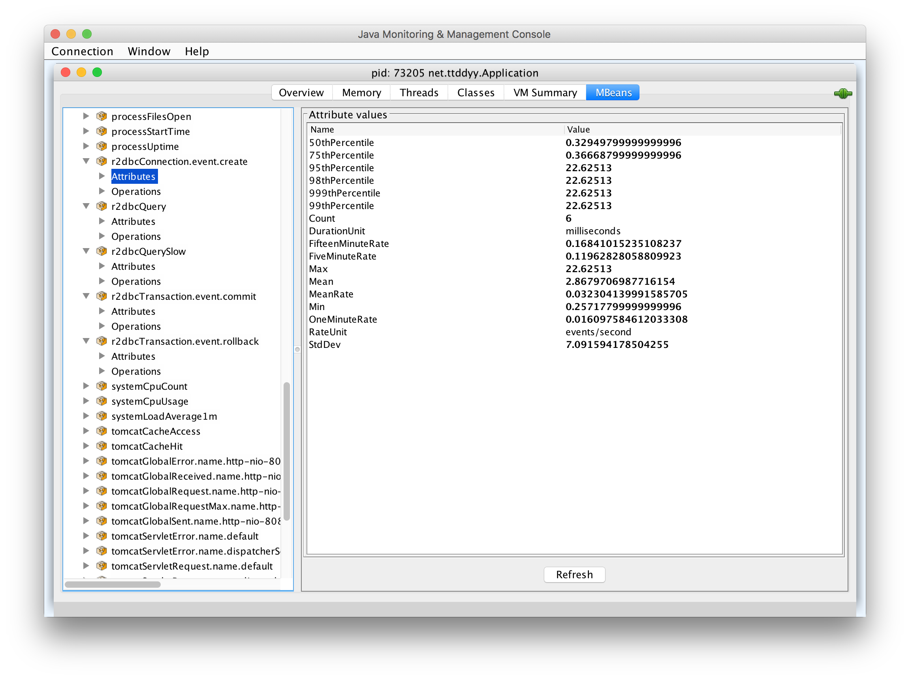
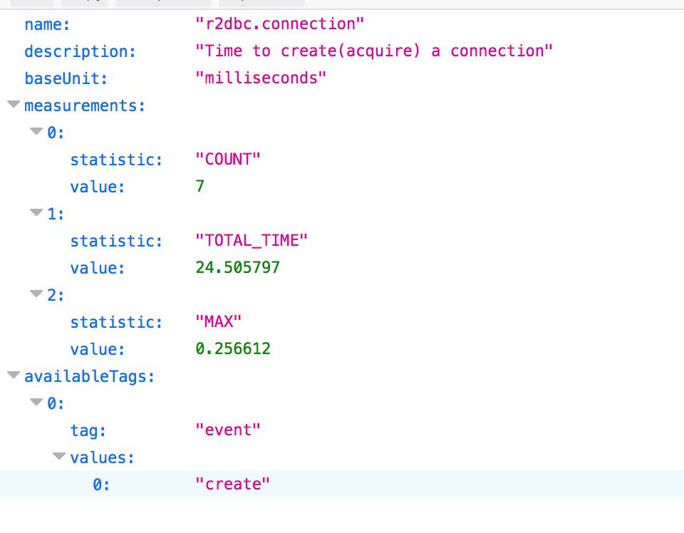

# About

[datasource-proxy-r2dbc][datasource-proxy-r2dbc] metrics sample application

This sample populates following metrics:

- Time took to create a connection
- Commit and rollback counts
- Executed query count
- Slow query count

Metrics are accessible via JMX and metrics endpoint(`/actuator/metrics`).

Also, logs slow queries that took more than 500ms.


## Implementation

**[MetricsExecutionListener](./src/main/java/net/ttddyy/MetricsExecutionListener.java)**

An implementation of [`LifeCycleListener`][LifeCycleListener] which populates micrometer metrics.


## Sample metrics images

*JMX entries:*


*Connection metrics on JMX:*



*Query metrics on JMX:*


*Connection metrics on actuator (`/actuator/metrics/r2dbc.connection`):*



*Transaction metrics on actuator (`/actuator/metrics/r2dbc.transaction`):*


*Slow query log:*


## How to run

Start `Application`

Access endpoints
```shell
> curl localhost:8080
> curl localhost:8080/batch
> curl localhost:8080/transaction
> curl localhost:8080/rollback
> curl localhost:8080/slow
```

Metrics actuator endpoint

```shell
> curl localhost:8080/actuator/metrics
```

----

[datasource-proxy-r2dbc]: https://github.com/ttddyy/datasource-proxy-r2dbc 
[LifeCycleListener]: https://github.com/ttddyy/datasource-proxy-r2dbc/blob/master/src/main/java/net/ttddyy/dsproxy/r2dbc/support/LifeCycleListener.java