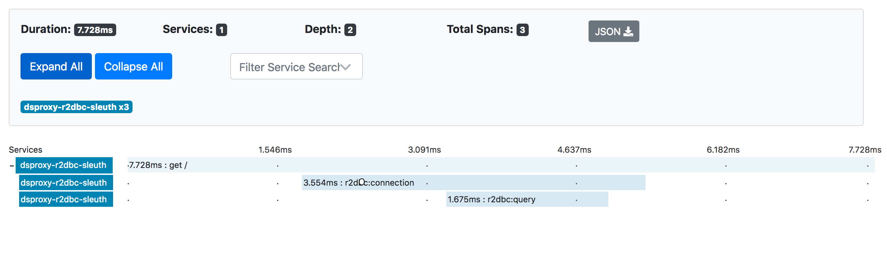
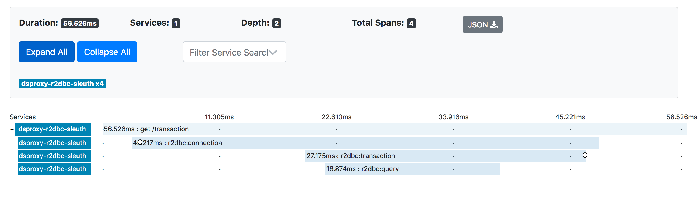
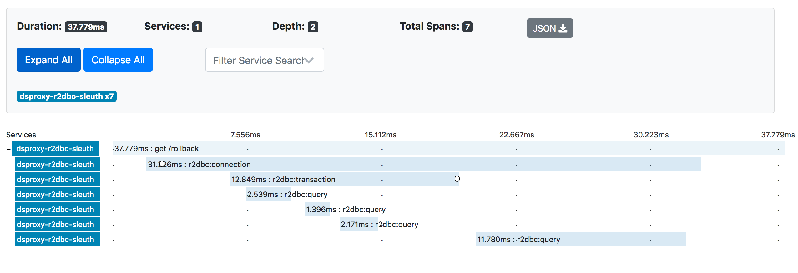
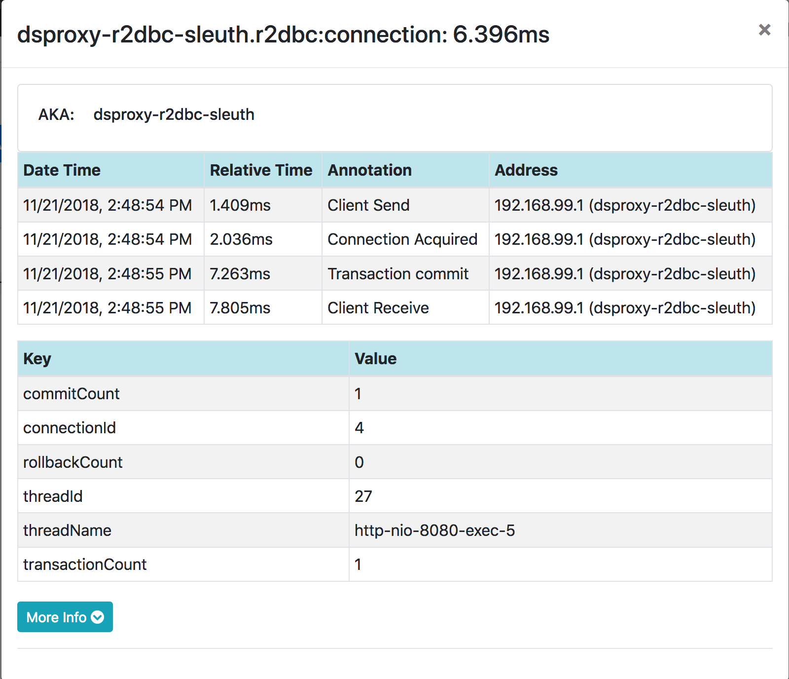
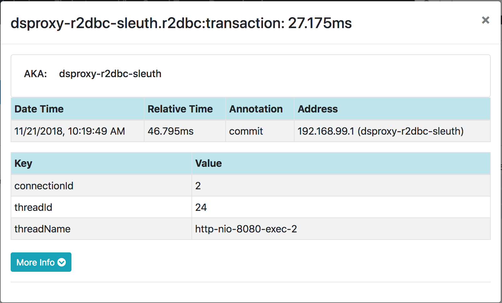
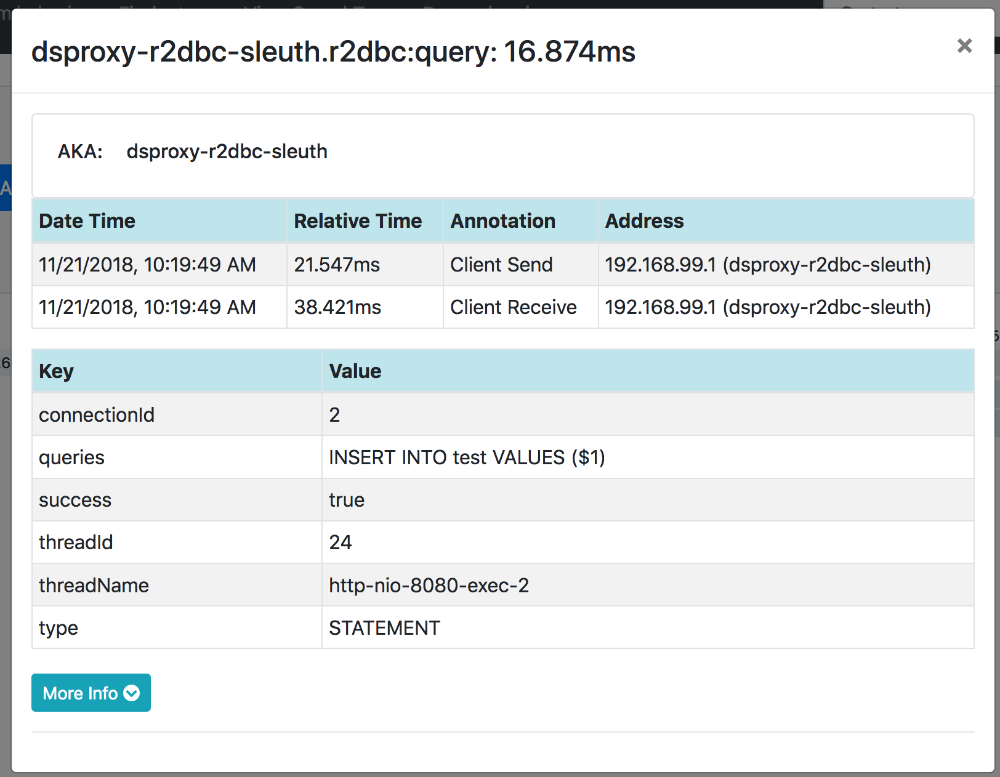
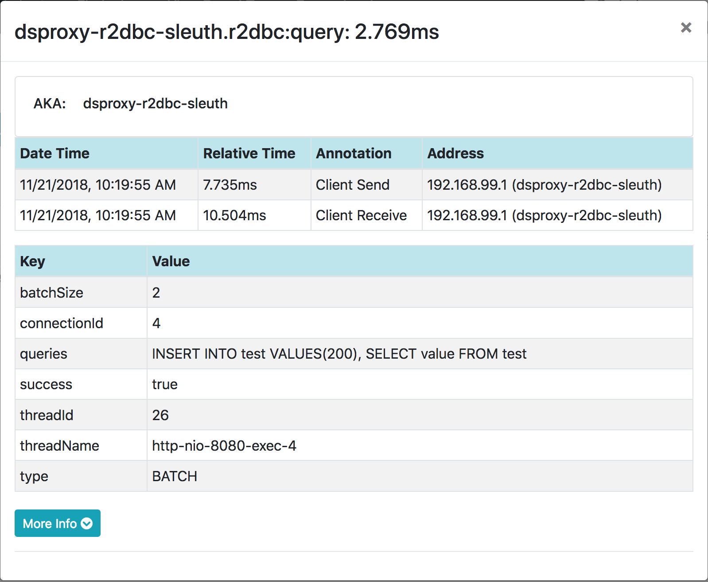

# About

[datasource-proxy-r2dbc][datasource-proxy-r2dbc] tracing sample application

## Implementation

**[TracingExecutionListener](./src/main/java/net/ttddyy/TracingExecutionListener.java)**

An implementation of [`LifeCycleListener`][LifeCycleListener] which creates tracing spans.


## Sample tracing images

Tracing query



Tracing transaction



Tracing transaction rollback



Connection Span



Transaction Span



Quey Span (Single Query)



Quey Span (Batch Query)



## How to run

Start zipkin
```shell
> docker run -d -p 9411:9411 openzipkin/zipkin
```

Start `Application`

Access endpoints
```shell
> curl localhost:8080
> curl localhost:8080/batch
> curl localhost:8080/transaction
> curl localhost:8080/rollback
```

----

[datasource-proxy-r2dbc]: https://github.com/ttddyy/datasource-proxy-r2dbc 
[LifeCycleListener]: https://github.com/ttddyy/datasource-proxy-r2dbc/blob/master/src/main/java/net/ttddyy/dsproxy/r2dbc/support/LifeCycleListener.java